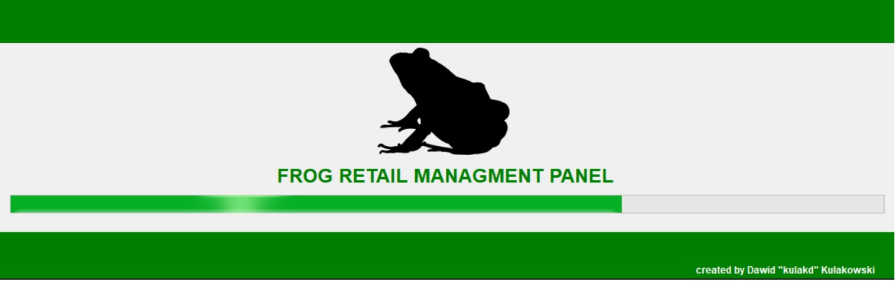
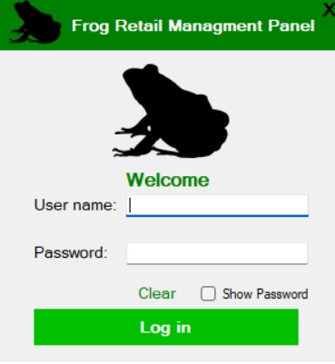
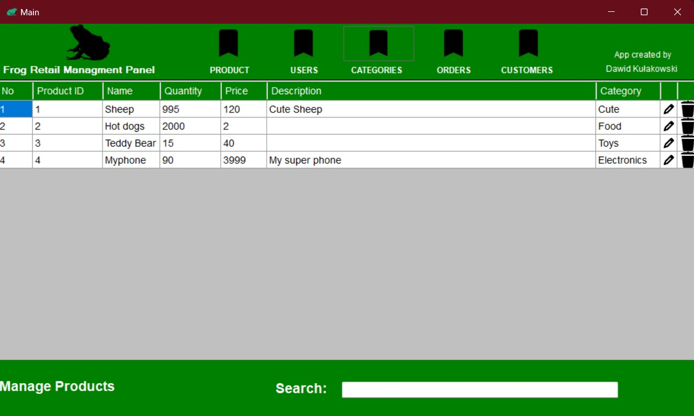
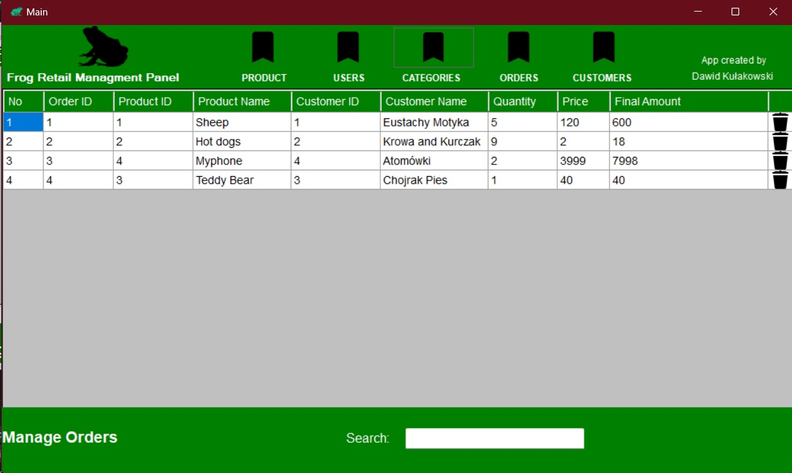
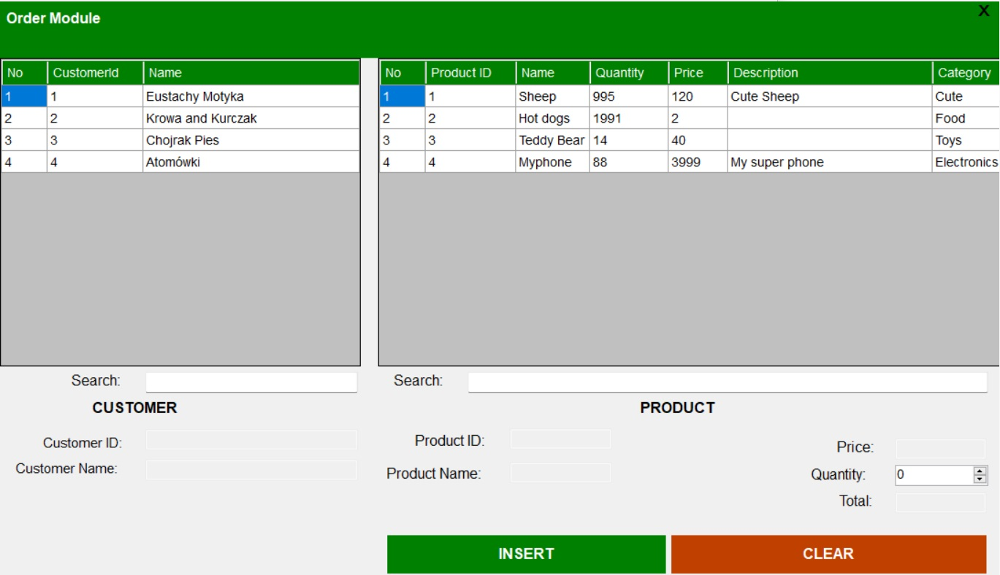

# RetailBaseManagmentPanel

An application made in C# .NET Windows Forms using a MS SQL database. 
It simulates the operations of a checkout system for an online store with options to:
-  add new users (including VIP)
-  managing orders
-  expanding the store's content
-  handle customers.

